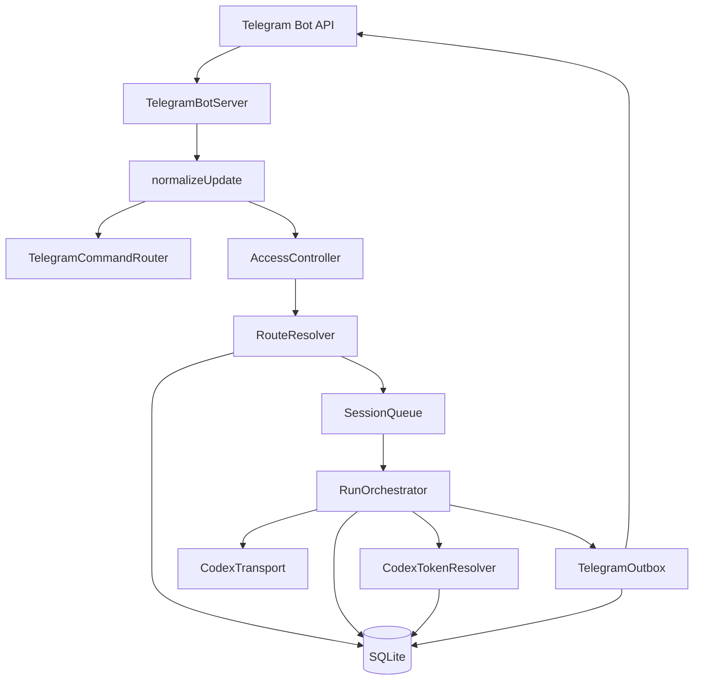
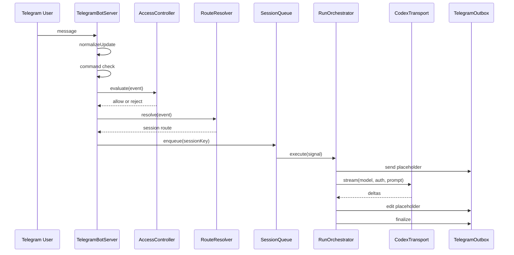

# Architecture

## Purpose

Mottbot is a Telegram-first control plane for Codex subscription-backed model runs. The system centers on a narrow runtime shape:

- keep the model provider boundary separate from chat transport
- serialize work per session
- persist sessions, transcripts, and runs locally
- treat Telegram as a thin ingress and rendering layer around a longer-lived agent runtime

The repo is intentionally narrow and does not include a generic plugin or multi-channel framework.

## Goals

- use the `openai-codex` subscription-backed provider path
- support local OAuth login or Codex CLI auth reuse
- keep one stable session per Telegram route
- stream partial output back into Telegram by editing a placeholder message
- keep the whole app host-local and easy to operate

## Non-Goals

- no multi-channel adapter layer
- no distributed worker fleet
- no plugin discovery system
- no direct public bot product posture in v1
- no general OpenAI API key path as the primary integration

## System Context



## Component Boundaries

### `src/app/*`

Bootstraps the process.

- `config.ts`: loads file and environment configuration, resolves paths, enforces required secrets
- `bootstrap.ts`: wires the stores, runtime components, and bot server together
- `shutdown.ts`: installs signal-based shutdown handling

### `src/telegram/*`

Owns Telegram-specific behavior.

- `bot.ts`: long-lived `grammY` process, message handler registration, polling or webhook lifecycle
- `update-normalizer.ts`: converts raw Telegram messages into stable `InboundEvent` records
- `acl.ts`: decides if the bot should act on a message
- `route-resolver.ts`: maps accepted events to a persistent session route
- `commands.ts`: handles operator commands without invoking the model
- `outbox.ts`: sends placeholder messages, edits them during streaming, finalizes or fails them
- `formatting.ts`: text splitting for Telegram message limits

### `src/sessions/*`

Owns route identity and concurrency.

- `session-key.ts`: deterministic session key generation
- `session-store.ts`: persistent route config and mutable session settings
- `transcript-store.ts`: transcript persistence
- `queue.ts`: strict one-run-at-a-time execution per session

### `src/runs/*`

Owns one model turn from start to finish.

- `run-orchestrator.ts`: top-level execution workflow
- `run-queue-store.ts`: durable queued-run metadata and single-process claim state
- `run-store.ts`: persisted run state
- `prompt-builder.ts`: rolling prompt construction from transcript history
- `stream-collector.ts`: accumulates streamed text and thinking deltas
- `usage-recorder.ts`: writes usage JSON back onto the run

### `src/codex/*`

Owns the subscription-backed provider boundary.

- `provider.ts`: model catalog and provider constants
- `auth-store.ts`: encrypted auth profile storage
- `oauth-login.ts`: local ChatGPT/Codex OAuth login bootstrap
- `cli-auth-import.ts`: reuse of Codex CLI `auth.json`
- `token-resolver.ts`: token loading, refresh, OAuth API key resolution, CLI write-back
- `transport.ts`: Pi AI streaming wrapper plus WebSocket-to-SSE fallback
- `usage.ts`: usage fetch against `/backend-api/wham/usage`

### `src/db/*`

Owns SQLite access and migrations.

- `client.ts`: opens the database and sets pragmas
- `migrate.ts`: applies schema bootstrap
- `schema.sql`: table definitions

### `src/shared/*`

Cross-cutting utilities.

- `crypto.ts`: AES-256-GCM secret storage helper
- `logger.ts`: pino logger factory
- `errors.ts`, `ids.ts`, `clock.ts`, `fs.ts`: support utilities

## Repository Layout

```text
src/
  app/
  codex/
  db/
  runs/
  sessions/
  shared/
  telegram/
test/
  app/
  codex/
  runs/
  sessions/
  shared/
  telegram/
docs/
  *.md
```

## Startup Flow

At process boot, `bootstrapApplication()` performs these steps:

1. Load config and create a logger.
2. Open SQLite and apply migrations.
3. Create the encrypted auth profile store.
4. Optionally import Codex CLI auth into the default profile.
5. Create the session, transcript, run, and transport state stores.
6. Create the token resolver and transport wrapper.
7. Create a provisional bot to obtain an API object for the outbox.
8. Create the outbox, orchestrator, and command router.
9. Create the final Telegram bot server and return a start/stop handle.

This is all done inside one process. There is no separate queue worker, scheduler, or sidecar.

## Main Runtime Flow



## Key Design Choices

### 1. Telegram is an adapter, not the core

All long-lived state lives in sessions, transcripts, runs, auth profiles, and transport state. Telegram only provides ingress and output rendering.

### 2. Sessions are the concurrency boundary

`SessionQueue` serializes work per `session_key`. `run_queue` persists accepted queued work so a restarted process can resume runs that never reached `starting`.

### 3. Provider logic is isolated

The undocumented subscription-backed behavior stays under `src/codex/*`. The rest of the bot only sees:

- a profile ID
- a model reference
- a resolved auth object
- a transport stream

That keeps a later provider swap tractable.

### 4. SQLite is the system of record

The process is host-local and single-instance. SQLite is the simplest correct store for this posture.

### 5. The implementation favors current correctness over speculative features

The code already includes some forward-looking schema such as `telegram_updates`, but the active runtime only documents behavior that is actually wired in today.

## Current Implementation vs Planned Hardening

Implemented now:

- polling mode
- webhook mode
- message normalization
- durable update dedupe using `telegram_updates`
- mention/reply-to-bot/bound-command ACL
- deterministic session routing
- run persistence and transcript persistence
- local OAuth login command
- Codex CLI auth import and refresh write-back
- WebSocket-first transport with SSE fallback
- throttled Telegram outbox edits
- restart recovery for `starting` and `streaming` runs
- durable recovery for accepted queued runs
- mid-stream outbox rebind when Telegram edit calls fail
- native image attachment input, attachment-aware prompt construction, and transcript compaction
- ingress safety limits for text length, attachment count, per-file size, and total known attachment size
- health reporting with queued, active, degraded, and stale outbox counters
- deny-by-default tool registry, health snapshot execution, and opt-in approved restart tool execution
- explicit session memory
- host-local instance lease
- CI release gate for install, native SQLite rebuild, check, tests, coverage, build, package validation, and dirty-worktree detection

Not yet implemented:

- native model input support for non-image file/media types
- side-effecting local-write, network, or secret-adjacent model-executed tools
- model-generated summarization or learned compaction
- distributed multi-instance locks or replica coordination

## Provider Boundary Rationale

The repo keeps the Codex integration narrow:

- separate `openai-codex` provider identity
- ChatGPT/Codex OAuth or CLI credential reuse
- model traffic routed through the Codex backend path
- per-session serialized execution

It intentionally does not include:

- generic plugin loading
- multi-surface app control plane
- a wider client/server control architecture

That is the main simplification.
