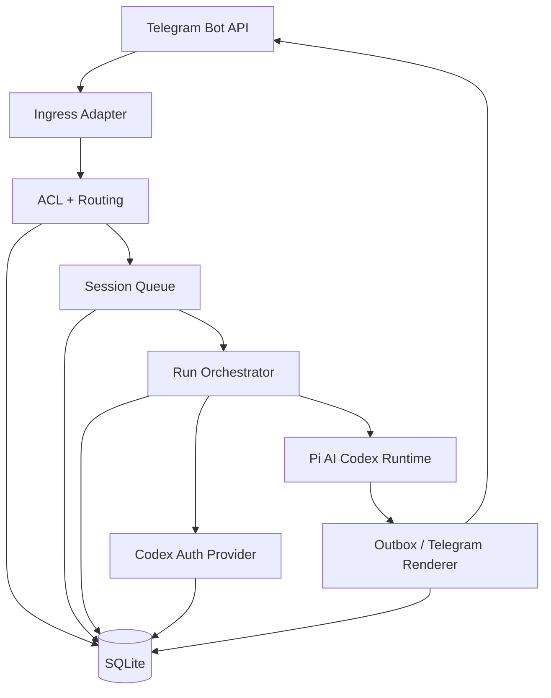

# Telegram Codex Subscription Bot Design Brief

Status: original single-file design brief

For the implementation-aligned documentation set, start with [README.md](./README.md).

This file is the original design brief that drove the scaffold. It is still useful as a single-pass architectural summary, but some sections describe target hardening that is not fully implemented yet.

## Objective

Build a Telegram bot that uses the subscription-backed OpenAI Codex path:

- authenticate with ChatGPT/Codex OAuth, or reuse an existing Codex CLI login
- resolve models under a dedicated `openai-codex/*` provider
- send model traffic to the Codex backend rather than the standard OpenAI API-key path
- stream results back into Telegram with stable session history and per-session serialization

This design is intentionally Telegram-first. It keeps the runtime focused and avoids a generic multi-channel framework.

## Explicit Constraints

- The bot must support the subscription-backed route, not just the standard OpenAI API.
- The implementation should prefer existing Codex runtime/auth behavior from `@mariozechner/pi-ai` instead of re-implementing undocumented protocol details.
- The system is initially single-instance and host-local.
- SQLite is the primary store.
- Telegram is the only user-facing transport in the current runtime.

## Non-Goals

- No multi-channel adapter layer in the current runtime.
- No plugin marketplace or generalized extension loader in the current runtime.
- No distributed worker fleet in the current runtime.
- No broad enterprise admin surface in the current runtime.

## Product Shape

The bot is a long-lived local service with five major responsibilities:

1. Receive Telegram updates and normalize them.
2. Decide whether the bot should answer and which session/profile should handle the turn.
3. Serialize execution per session.
4. Execute Codex-backed model runs using the subscription-backed `openai-codex` path.
5. Stream partial and final output back to Telegram.

## Core Decision

Do not directly reproduce unsupported provider behavior from scratch.

Instead:

- use `@mariozechner/pi-ai/oauth` for:
  - `loginOpenAICodex`
  - `getOAuthApiKey`
  - `refreshOpenAICodexToken`
- use `@mariozechner/pi-ai` streaming/runtime primitives for Codex-backed model execution
- wrap those in a smaller, Telegram-specific application

This keeps the unsupported backend-specific logic in one dependency instead of spreading it across the app.

## High-Level Architecture



## Proposed Repository Layout

```text
src/
  app/
    bootstrap.ts
    config.ts
    shutdown.ts
  telegram/
    bot.ts
    update-normalizer.ts
    acl.ts
    route-resolver.ts
    commands.ts
    outbox.ts
    formatting.ts
  sessions/
    session-key.ts
    queue.ts
    session-store.ts
    transcript-store.ts
  runs/
    run-orchestrator.ts
    prompt-builder.ts
    stream-collector.ts
    usage-recorder.ts
  codex/
    provider.ts
    oauth-login.ts
    cli-auth-import.ts
    token-resolver.ts
    transport.ts
    usage.ts
  db/
    client.ts
    migrate.ts
    schema.sql
  shared/
    ids.ts
    clock.ts
    logger.ts
    errors.ts
docs/
  telegram-codex-design.md
```

## Runtime Components

### 1. `telegram/bot.ts`

Owns the Telegram connection.

Responsibilities:

- start polling or webhook mode
- deduplicate updates
- convert raw Telegram updates into normalized inbound events
- hand off normalized events to routing

Recommendation:

- use `grammY`
- support polling first
- keep webhook support as a config option

### 2. `telegram/update-normalizer.ts`

Produces a stable internal event shape:

```ts
type InboundEvent = {
  updateId: number;
  chatId: string;
  chatType: "private" | "group" | "supergroup" | "channel";
  messageId: number;
  threadId?: number;
  fromUserId?: string;
  fromUsername?: string;
  text?: string;
  caption?: string;
  entities: NormalizedEntity[];
  attachments: NormalizedAttachment[];
  replyToMessageId?: number;
  mentionsBot: boolean;
  isCommand: boolean;
  arrivedAt: number;
};
```

The rest of the system never touches raw Telegram payloads.

### 3. `telegram/acl.ts`

Determines if a message is eligible for bot handling.

Rules:

- private chats: allowed if sender is in the allowlist
- groups/supergroups: default deny unless one of:
  - bot is directly mentioned
  - message replies to a bot message
  - chat is explicitly bound to always-on mode
  - message is an admin command
- channels: unsupported in the current runtime

Additional rules:

- maintain admin allowlist by Telegram user ID
- optionally maintain allowed chat allowlist
- reject oversized messages before model invocation

### 4. `telegram/route-resolver.ts`

Maps an inbound event to a `session_key`.

Session key rules:

- private chat:
  - `tg:dm:<chat_id>`
- private chat with per-user isolation override:
  - `tg:dm:<chat_id>:user:<user_id>`
- group without topics:
  - `tg:group:<chat_id>`
- group topic:
  - `tg:group:<chat_id>:topic:<thread_id>`
- explicit admin-bound route:
  - `tg:bound:<binding_id>`

Recommendation:

- default private chats to one session per chat
- default group topics to one session per topic
- only allow plain group-wide sessions after explicit binding

### 5. `sessions/queue.ts`

Provides strict per-session serialization.

Behavior:

- at most one active run per `session_key`
- additional inbound events are queued
- support cancellation of the currently active run
- support queue replacement for commands like `/reset` or `/stop`

This is a key runtime rule for keeping Telegram sessions predictable.

### 6. `runs/run-orchestrator.ts`

Owns one complete turn.

Steps:

1. load session config
2. load recent transcript
3. resolve model and auth profile
4. allocate placeholder Telegram output message
5. start model stream
6. persist assistant output incrementally
7. finalize usage, status, and transcript

Run states:

- `queued`
- `starting`
- `streaming`
- `completed`
- `failed`
- `cancelled`

### 7. `codex/provider.ts`

Exposes the subscription-backed model provider interface inside this app.

Provider ID:

- `openai-codex`

Primary model refs:

- `openai-codex/gpt-5.4`
- `openai-codex/gpt-5.4-mini`
- `openai-codex/gpt-5.3-codex-spark` if entitlement exists

Provider behavior:

- normalize model API to `openai-codex-responses`
- normalize base URL to `https://chatgpt.com/backend-api`
- default transport to `auto`
- expose usage fetch via `https://chatgpt.com/backend-api/wham/usage`

### 8. `codex/oauth-login.ts`

Implements local OAuth bootstrap.

Flow:

1. generate PKCE verifier/challenge and `state`
2. create localhost callback listener on `127.0.0.1:1455`
3. open browser to OpenAI authorize URL
4. accept pasted callback URL/code when localhost callback is not available
5. exchange for credentials through `loginOpenAICodex`
6. persist credentials

Stored fields:

- `access_token`
- `refresh_token`
- `expires_at`
- `account_id`
- `email`
- `display_name`
- `source = local_oauth`

### 9. `codex/cli-auth-import.ts`

Reuses an existing Codex CLI login.

Lookup path:

- `$CODEX_HOME/auth.json`
- fallback: `~/.codex/auth.json`

Rules:

- only import if `auth_mode == "chatgpt"`
- copy access/refresh/account metadata into a runtime profile view
- mark source as `codex_cli`
- treat imported credentials as externally managed

Important behavior:

- if the app boots and sees a fresh CLI credential, it should prefer the CLI-backed profile for the default profile if configured to do so
- if the local DB already contains a conflicting owned credential for the same default profile, do not silently overwrite it

### 10. `codex/token-resolver.ts`

Resolves a usable token for each run.

Cases:

- non-expired local OAuth credential:
  - use stored access token
- expired local OAuth credential:
  - refresh under a profile lock
- CLI-backed profile:
  - re-read CLI auth file first
  - if refresh is needed and Pi runtime can refresh through that profile, write the refreshed token back to CLI-owned storage or treat CLI state as authoritative

Implementation rule:

- all refresh logic must be guarded by a per-profile mutex so two runs do not refresh the same credential concurrently

### 11. `codex/transport.ts`

Wraps Pi streaming with Telegram-friendly semantics.

Behavior:

- transport mode default: `auto`
- try WebSocket first
- on early retryable failure, retry once
- if still failing, fall back to SSE
- mark the session transport as degraded for 60 seconds after early WebSocket failure

Persisted state:

- last known transport for the run
- degradation expiration per session

### 12. `telegram/outbox.ts`

Manages partial and final Telegram output.

Rules:

- send one placeholder message when a run starts
- edit the same message while the model is streaming
- throttle edits to avoid Telegram flood limits
- split into continuation messages if final output exceeds Telegram limits
- attach errors as user-readable short summaries

Edit policy:

- minimum edit interval: 600-900 ms
- force final edit on completion
- if edit fails due to stale message state, send a new continuation message and rebind the outbox record

## Session Model

Each session contains:

- one route binding
- one transcript
- one selected model ref
- one selected auth profile
- optional system prompt/persona
- runtime flags such as `fast_mode`

Default session config:

```json
{
  "model": "openai-codex/gpt-5.4",
  "profile": "openai-codex:default",
  "fastMode": false
}
```

### Session Commands

Admin/system commands:

- `/status`
- `/model <ref>`
- `/profile <id>`
- `/fast on|off`
- `/new`
- `/reset`
- `/stop`
- `/bind here`
- `/unbind`

Auth commands:

- `/auth status`
- `/auth login`
- `/auth import-cli`

Recommendation:

- `/auth login` should not do OAuth inside Telegram directly
- it should generate a host-side action or print a local command the operator runs on the server

## Prompt and Transcript Policy

Transcript shape:

- keep normalized user turns
- keep assistant turns as rendered text
- keep tool calls as structured JSON if tools are later added
- store referenced attachment metadata separately

History policy:

- retain full transcript in DB
- send only a rolling window to the model
- summarize older history when token pressure grows

Initial prompt policy:

- system prompt defines bot behavior, safety boundary, and Telegram formatting rules
- inject route metadata only as needed
- do not leak internal IDs or DB metadata into the prompt

## Storage Design

Database: SQLite in WAL mode

Recommended pragmas:

- `journal_mode = WAL`
- `synchronous = NORMAL`
- `busy_timeout = 5000`
- `foreign_keys = ON`

### Tables

#### `auth_profiles`

```sql
create table auth_profiles (
  profile_id text primary key,
  provider text not null,
  source text not null,              -- local_oauth | codex_cli
  access_token_ciphertext text,
  refresh_token_ciphertext text,
  expires_at integer,
  account_id text,
  email text,
  display_name text,
  metadata_json text,
  created_at integer not null,
  updated_at integer not null
);
```

#### `session_routes`

```sql
create table session_routes (
  session_key text primary key,
  chat_id text not null,
  thread_id integer,
  user_id text,
  route_mode text not null,          -- dm | group | topic | bound
  bound_name text,
  profile_id text not null,
  model_ref text not null,
  fast_mode integer not null default 0,
  system_prompt text,
  created_at integer not null,
  updated_at integer not null
);
create index idx_session_routes_chat on session_routes(chat_id, thread_id);
```

#### `messages`

```sql
create table messages (
  id text primary key,
  session_key text not null,
  run_id text,
  role text not null,                -- user | assistant | system | tool
  telegram_message_id integer,
  reply_to_telegram_message_id integer,
  content_text text,
  content_json text,
  created_at integer not null,
  foreign key (session_key) references session_routes(session_key)
);
create index idx_messages_session_created on messages(session_key, created_at);
```

#### `runs`

```sql
create table runs (
  run_id text primary key,
  session_key text not null,
  status text not null,              -- queued | starting | streaming | completed | failed | cancelled
  model_ref text not null,
  profile_id text not null,
  transport text,                    -- websocket | sse
  request_identity text,
  started_at integer,
  finished_at integer,
  error_code text,
  error_message text,
  usage_json text,
  created_at integer not null,
  updated_at integer not null,
  foreign key (session_key) references session_routes(session_key)
);
create index idx_runs_session_created on runs(session_key, created_at);
```

#### `telegram_updates`

```sql
create table telegram_updates (
  update_id integer primary key,
  chat_id text,
  message_id integer,
  processed_at integer not null
);
```

#### `outbox_messages`

```sql
create table outbox_messages (
  id text primary key,
  run_id text not null,
  chat_id text not null,
  thread_id integer,
  telegram_message_id integer,
  state text not null,               -- pending | active | superseded | final | failed
  last_rendered_text text,
  last_edit_at integer,
  created_at integer not null,
  updated_at integer not null,
  foreign key (run_id) references runs(run_id)
);
create index idx_outbox_run on outbox_messages(run_id);
```

#### `transport_state`

```sql
create table transport_state (
  session_key text primary key,
  websocket_degraded_until integer,
  last_transport text,
  updated_at integer not null
);
```

## Secrets and Encryption

Sensitive values:

- access token
- refresh token
- Telegram bot token

Design:

- encrypt OAuth tokens at rest using an app master key
- prefer OS keychain-backed master key loading on macOS
- fallback to `MOTTBOT_MASTER_KEY` for server deployments

Rules:

- never log tokens
- never expose tokens through Telegram admin commands
- redact auth fields in all structured logs

## Configuration

Example config:

```json
{
  "telegram": {
    "botTokenEnv": "TELEGRAM_BOT_TOKEN",
    "polling": true,
    "adminUserIds": ["123456789"],
    "allowedChatIds": ["123456789", "-1001111111111"]
  },
  "models": {
    "default": "openai-codex/gpt-5.4",
    "transport": "auto"
  },
  "auth": {
    "defaultProfile": "openai-codex:default",
    "preferCliImport": true
  },
  "storage": {
    "sqlitePath": "./data/mottbot.sqlite"
  },
  "behavior": {
    "respondInGroupsOnlyWhenMentioned": true,
    "editThrottleMs": 750
  }
}
```

## Exact Codex Subscription Path

This section is the most important implementation contract.

### Provider Identity

- provider ID: `openai-codex`
- logical API: `openai-codex-responses`
- default base URL: `https://chatgpt.com/backend-api`

### Auth Source Priority

1. explicitly selected local OAuth profile
2. explicitly selected imported CLI profile
3. configured default profile
4. runtime default profile imported from Codex CLI

### Runtime Token Resolution

For each run:

1. resolve the selected profile
2. if source is `codex_cli`, re-read CLI auth file before using cached DB values
3. if token is expired, refresh under lock
4. hand resolved credentials to the Pi runtime
5. use returned runtime auth material to execute the Codex request

### Usage Fetch

When the user requests usage or status:

- send a bearer-authenticated GET request to `/wham/usage`
- include `ChatGPT-Account-Id` when `account_id` is known
- map windows into user-facing quota summaries

## Telegram Rendering Rules

Formatting:

- preserve code blocks
- avoid HTML mode unless necessary
- escape Telegram Markdown formatting correctly if using Markdown mode
- default to plain text plus fenced code blocks

Streaming:

- partial updates should be human-readable, not token-by-token noise
- flush on sentence or paragraph boundaries when possible
- if the model emits long code blocks, prefer fewer larger edits

Errors:

- auth expired:
  - "Authentication expired. Re-run local auth login."
- rate limit:
  - include reset window if known
- transport failure:
  - retry once and then send short failure summary

## Failure Modes and Handling

### OAuth failure

- mark profile as unhealthy
- keep profile row
- do not delete cached metadata
- surface remediation through local CLI and `/auth status`

### CLI auth drift

- if CLI auth file disappears, mark imported profile unavailable
- do not silently switch sessions to a different profile

### Telegram delivery failure

- retry transient 429 and 5xx errors with backoff
- if edits fail repeatedly, send a fresh message

### WebSocket instability

- retry once
- fall back to SSE
- record degraded-until timestamp per session

### Crash recovery

- on startup, mark `starting` and `streaming` runs as `failed`
- keep partial assistant text
- let next user turn continue from persisted transcript

## Observability

Structured logs:

- inbound update accepted/rejected
- session key chosen
- run started/completed/failed
- transport chosen and fallbacks
- auth resolution path: `local_oauth` vs `codex_cli`
- Telegram send/edit retries

Metrics:

- updates received
- accepted vs rejected messages
- run latency
- first-token latency
- completion latency
- WebSocket fallback count
- auth refresh count
- Telegram edit failures

## Testing Strategy

### Unit tests

- session key derivation
- ACL rules
- CLI auth import parsing
- token refresh locking
- outbox chunking and edit throttling

### Integration tests

- Telegram update -> session route -> queued run
- expired token refresh path
- CLI auth runtime import path
- WebSocket fail -> SSE fallback
- crash recovery on half-finished runs

### Live tests

- host-local OAuth login
- actual Codex-backed run with streamed output
- usage fetch against `/wham/usage`

## Implementation Phases

### Phase 1: foundation

- config loader
- SQLite schema and migrations
- Telegram polling adapter
- update normalization
- ACL and route resolver

### Phase 2: subscription auth

- local OAuth login command
- CLI auth import
- encrypted token store
- token resolver with lock

### Phase 3: model execution

- `openai-codex` provider
- Pi runtime integration
- per-session queue
- outbox streaming edits

### Phase 4: operator features

- admin commands
- `/status`
- `/profile`
- `/model`
- usage display

### Phase 5: hardening

- webhook mode
- crash recovery
- transport degradation cache
- structured metrics

## Future Implementation Roadmap

The implementation is now past the original five-phase scaffold. Future work should be sequenced as capability layers so the bot remains useful without weakening operator safety.

Detailed deliverables, edge cases, and required tests for these phases live in `docs/completion-test-plan.md`. This design section is intentionally higher level; do not treat it as a substitute for the phase test matrix.

Ordering constraints:

- Phase 11 should happen before additional user-facing capabilities so discovery does not lag implementation.
- Phase 12 should precede broader Telegram UI/action tools so reaction policy, update routing, and side-effect approval patterns are established first.
- Phase 14 is required before broad repository tools or any write-capable tool.
- Phase 15 should precede Phase 16 so local repository inspection patterns are established before remote GitHub context.
- Phase 21 should precede Phase 22 so model and cost policy can attach to roles and chat governance.
- Phase 20 should not begin without the approval preview, policy, and audit requirements from Phase 14.

### Phase 11: command discovery and conversation UX

Design intent:

- make Telegram the primary command discovery surface
- show caller-specific help based on role, chat type, and enabled features
- explain the difference between enabled tools and model-exposed tools
- keep progress and tool-status messages concise and stable enough for smoke tests

Primary user-facing additions:

- `/help`
- `/tool help` or a shorter `/tools`
- improved status text for long runs, tool calls, denials, and recoverable failures

### Phase 12: Telegram reactions

Design intent:

- add OpenClaw-style reaction acknowledgement without replacing text status messages
- ingest meaningful user reactions as lightweight session context
- keep model-initiated reactions behind the existing side-effect approval workflow
- preserve safe behavior in groups and topics despite Telegram reaction updates lacking topic thread IDs

Primary user-facing additions:

- configurable processing acknowledgement reaction
- optional acknowledgement reaction cleanup after replies
- reaction notifications in the next model turn
- approved `mottbot_telegram_react` model tool for admins

### Phase 13: general file understanding

Status: complete for bounded text, Markdown, code, CSV, TSV, and PDF extraction into active-run prompt context.

Design intent:

- move beyond image-only native attachment support
- extract bounded text from text, Markdown, PDF, code, CSV, and TSV attachments
- keep raw file bytes out of SQLite and committed paths
- preserve clear metadata and truncation markers in transcripts

Primary user-facing additions:

- summaries of uploaded documents
- file extraction failure messages that explain size, type, encryption, or parsing limits
- `/files` or equivalent session attachment inspection

Implemented notes:

- raw extracted file text is not persisted in SQLite
- `attachment_records` stores retained metadata and extraction summaries for `/files`
- unsupported binaries and unreadable PDFs remain explicit metadata rather than leaking local cache paths or Telegram file URLs

### Phase 14: tool permission model

Design intent:

- add policy before adding powerful tools
- make every side effect explain itself before approval
- audit every approve, deny, expire, consume, and execute decision
- keep deny-by-default behavior for missing policy

Status:

- complete for enabled runtime tools
- policy is loaded from config, declarations are filtered by role and chat, execution rechecks policy, previews are sanitized, and `/tool audit` exposes bounded admin inspection

Core policy dimensions:

- role
- chat/session
- side-effect class
- approval requirement
- dry-run support
- output and timeout limits

### Phase 15: read-only local repository tools

Design intent:

- let the model inspect approved local repositories without write access
- default-deny secrets, auth files, SQLite files, logs, generated output, and ignored paths
- use structured path resolution rather than string path checks
- prefer `rg` and bounded file slices for fast, controlled inspection

Status:

- complete for admin-only local repository inspection tools
- approved roots, denied paths, realpath checks, bounded reads/search, and git status/branch/commit/diff summaries are implemented

Initial tools:

- list approved files
- read bounded file ranges
- search text
- summarize git status, branch, recent commits, and diffs

### Phase 16: GitHub read integration

Design intent:

- add GitHub context without write permissions first
- support repository, pull request, issue, and CI status inspection
- keep GitHub credentials out of logs, Telegram replies, and transcripts
- make missing auth or rate-limit behavior clear to the operator

Status:

- complete for host-local GitHub CLI read integration; see `docs/completion-test-plan.md` and `docs/tool-use-design.md` for the implementation checklist and tool surface

Initial surfaces:

- read-only model tools: repository metadata, open pull requests, open issues, CI status, and workflow failures
- admin commands for concise repository and CI status
- mocked tests by default, optional live read-only validation

### Phase 17: operator dashboard

Design intent:

- turn the dashboard into the local control panel
- expose health, runs, errors, logs, tools, approvals, and memory behind dashboard auth
- keep loopback-only posture unless explicitly configured otherwise
- validate all dashboard mutations server-side

Primary panels:

- runtime health
- recent runs and errors
- tool exposure and approvals
- memory inspection/editing
- safe service controls

### Phase 18: model-assisted memory

Design intent:

- upgrade from deterministic summaries to reviewed model-proposed memories
- keep sensitive or long-lived facts out of memory until approved
- support personal, chat, group, and project scopes
- store memory candidates separately from accepted memories

Primary user-facing additions:

- memory candidate review
- accept/reject/edit/pin/archive commands
- scoped memory rendering in prompts

### Phase 19: backup, log rotation, and recovery hardening

Design intent:

- make local operations repeatable instead of manual
- back up SQLite and associated WAL/SHM files correctly
- archive and rotate launchd logs without committing generated output
- document restore and migration checks before operators need them

Primary surfaces:

- backup CLI command
- restore dry-run validator if practical
- log archive/truncate workflow
- updated setup and operations runbooks

### Phase 20: write-capable approved tools

Design intent:

- add side effects only after policy, preview, and audit controls are in place
- keep all write tools disabled by default
- require explicit approval with a target-specific preview
- validate writes against disposable targets before real operator use

Initial low-risk writes:

- write a draft note in an approved local directory
- send a Telegram message to an approved chat
- later, create GitHub issues or draft PR/comment content

### Phase 21: multi-user roles and chat governance

Design intent:

- move from single-owner operation to controlled multi-user operation
- define owner, admin, trusted user, and normal user roles
- add per-chat policy for models, tools, memory scopes, and attachment limits
- audit role and policy changes

Primary user-facing additions:

- user/role listing
- grant and revoke commands
- per-chat policy inspection
- permission matrix tests across chat types

### Phase 22: model and cost controls

Design intent:

- bound usage as the bot becomes more capable and multi-user
- track usage by session, chat, user, model, and time window where provider data allows it
- add role- and chat-specific model policy
- expose operator reporting without leaking account IDs or credentials

Primary user-facing additions:

- `/usage`
- budget warnings
- run-cap denial messages
- role-aware model defaults

## Operational Guidance

Recommended deployment:

- one local process
- one SQLite file
- polling mode
- admin-only private use first

Do not start with:

- shared public group deployment
- multiple bot instances against the same SQLite file
- direct reverse-engineering of Codex protocol internals beyond what Pi already handles

## Upgrade Path

If the unsupported Codex subscription path becomes unstable, the app should be able to switch providers without changing Telegram/session behavior.

Preserve this abstraction boundary:

- Telegram layer does not know how the model is authenticated
- session layer does not know which backend host is used
- only `src/codex/*` owns the `openai-codex` subscription path

That makes a future move to the official OpenAI API or Codex SDK operationally cheap.

## Build Recommendation

Language and stack:

- TypeScript
- Node.js
- `grammY`
- `better-sqlite3`
- `@mariozechner/pi-ai`

This is the closest practical way to keep subscription-backed Codex behavior isolated while keeping the app small enough to maintain.
